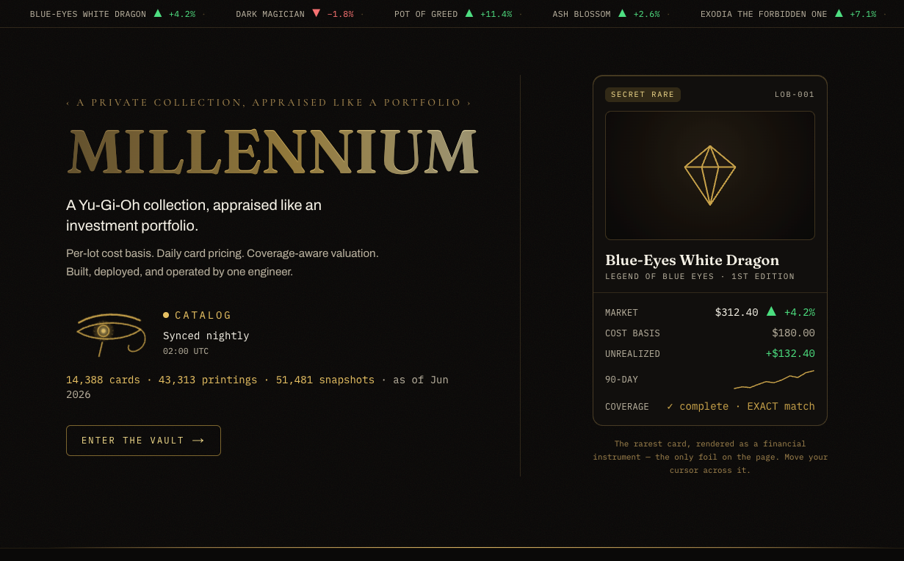

# Millennium

[](https://github.com/erick-ti/millennium/actions/workflows/tests.yml)
[](https://github.com/erick-ti/millennium/actions/workflows/frontend.yml)
[](https://github.com/erick-ti/millennium/actions/workflows/e2e.yml)
[](https://github.com/erick-ti/millennium/actions/workflows/images.yml)
[](https://github.com/erick-ti/millennium/actions/workflows/gitleaks.yml)
[](https://github.com/erick-ti/millennium/security/code-scanning)

Millennium is a personal Yu-Gi-Oh card collection tracker that treats a collection like an investment portfolio: per-lot cost basis, confidence-scored pricing from multiple sources, and daily historical valuation. Cards are imported from external scanner-app CSV exports; prices refresh on a daily schedule rather than in real time.



## Live

Running at **https://millennium.erickti.com**. A one-click read-only demo (no account needed) opens the full authenticated app against the real collection data, so you can browse the collection, price history, portfolios, movers, and decks without signing in. The demo session is blocked from every write.

## What it does

- Imports Dragon Shield CSV exports, staging each row and matching it to a card printing (set code, rarity, edition) before it touches the collection.
- Tracks each acquisition as a lot with its own cost basis, so quantity and cost roll up from the ledger rather than being stored on the item.
- Ingests daily prices from TCGCSV (metadata from YGOPRODeck) into an append-only price history with a confidence score per point.
- Values each portfolio daily with condition factors and a liquidation haircut, recording partial-coverage counts so a total never silently looks complete when some cards are unpriced.
- Surfaces the analytics on top: biggest movers over a window, percent-move price alerts, and deck grouping.

## Stack

- **Frontend:** Next.js (App Router) + React + TypeScript, Tailwind CSS + shadcn/ui, TanStack Table + TanStack Query, Recharts
- **Backend:** Django 5.2 LTS + Django REST Framework + drf-spectacular
- **Database:** PostgreSQL 16
- **Cache / queue:** Redis in development; production drops Redis and uses Django's database cache on Postgres
- **Scheduled jobs:** Celery + Celery Beat in development; systemd timers in production
- **API contract:** OpenAPI schema generates a typed TypeScript client, both committed and drift-gated in CI
- **Testing:** pytest (backend), Vitest + React Testing Library (frontend), Playwright (end-to-end smoke)
- **Deploy:** self-hosted on a single VPS behind a Caddy edge, with pull-based continuous deployment
- **Tooling:** Docker Compose, uv (Python), GitHub Actions

## Architecture

A modular Django monolith (apps: `core`, `cards`, `pricing`, `portfolio`, `collection`, `imports`, `valuation`, plus analytics apps) serves a JSON API that a Next.js frontend consumes through a same-origin `/api/*` proxy. PostgreSQL holds a three-level card hierarchy (cards to printings to collection items), per-acquisition cost-basis lots, and append-only price and valuation snapshots. The daily metadata sync, price ingestion, valuation, and alert jobs run as scheduled tasks under advisory locks with recorded run history. In production the whole stack is self-hosted on one VPS behind a Caddy edge that terminates TLS, and a poller deploys merges to `main` within a couple of minutes. See [ARCHITECTURE.md](ARCHITECTURE.md) for the topology, invariants, and operational detail, and [ROADMAP.md](ROADMAP.md) for milestone history.

## Quickstart

Prerequisites: Docker (with Compose), plus [uv](https://github.com/astral-sh/uv) and Node.js if you want to run lint, tests, or tooling on the host.

```bash
make dev        # docker compose up: postgres + redis + backend + celery worker + beat + frontend
make superuser  # create an admin account
make migrate-up # apply migrations (make migrate creates them)
```

The frontend serves at http://localhost:3000 and proxies the API at http://localhost:8000.

Common commands (all from the repo root, see the `Makefile`):

```bash
make test    # pytest, sqlite in-memory, no Docker needed
make lint    # ruff check + mypy (strict)
make format  # ruff format + fixes
make e2e     # seed fixtures and run the Playwright smoke suite
make down    # stop the stack
```

## License

[MIT](LICENSE)
